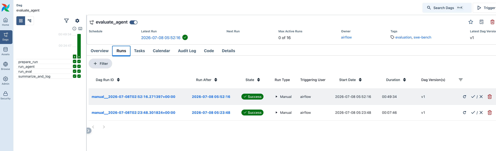
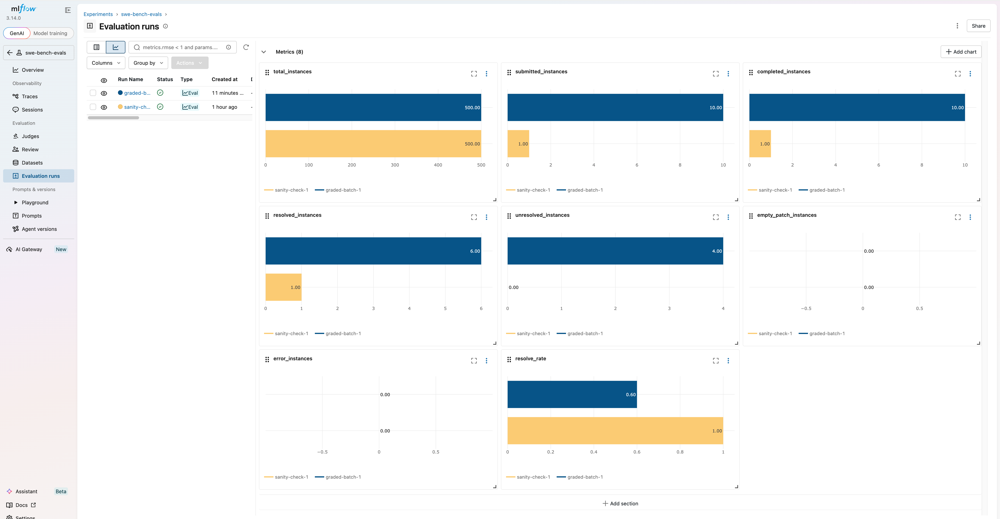

# Coding-Agent Eval Harness

> An end-to-end MLOps pipeline that runs coding agents against SWE-bench and turns every
> experiment into a reproducible, comparable, durable artifact — one Airflow trigger from
> config to metrics.


## Demo

Deployed to a Nebius VM under the full `docker-compose` stack; a real 10-instance batch
resolved 6/10 (`resolve_rate 0.6`) — full evidence in [REPORT.md](REPORT.md) and
[`runs/graded-batch-1/`](runs/graded-batch-1/).




## What This Project Demonstrates

- **Pipeline orchestration** — a parameterized Airflow DAG (`prepare_run → run_agent →
  run_eval → summarize_and_log`) with retries, timeouts, and zero hard-coded experiment values
- **Experiment tracking** — every run's params, metrics, and artifact URIs logged to MLflow
  and comparable across models/configs
- **Reproducibility engineering** — each run emits a self-describing `runs/<run-id>/` tree
  (config, trajectories, predictions, eval reports, metrics, manifest) uploaded to S3
- **Execution isolation** — agent and evaluation steps run via `DockerOperator` in a pinned
  image; the SWE-bench harness spawns per-instance test containers
- **Clean layered architecture** — orchestration and execution environments strictly
  separated behind one CLI contract (see [PLAN.md](PLAN.md))

## Quick Start

```bash
git clone https://github.com/MGhanayim/coding-agent-eval-harness.git && cd coding-agent-eval-harness
uv sync
cp .env.example .env          # add your NEBIUS_API_KEY; on Linux set DOCKER_GID + HOST_PROJECT_DIR

# Easy mode: standalone Airflow (subprocess execution)
bash run-airflow-standalone.sh                    # UI at http://localhost:8080 (admin/admin)

# Production mode: full stack (DockerOperator execution)
docker build -t coding-agent-eval-harness:latest .   # the task image the operators run
docker compose up -d                                 # Airflow + MLflow + MinIO (UI: airflow/airflow)
```

Unpause the `evaluate_agent` DAG, then trigger it with e.g. `task_slice=0:3` for a
3-instance smoke run. (The trigger form requires `run_id` — any unused slug works;
leave the rest at their defaults.)

## Architecture

Airflow orchestrates; all real work runs behind `python -m pipeline.cli <step>` in an
isolated execution environment (project venv locally, Docker image in production). Each run
writes a reproducible artifact tree, ships it to object storage, and registers itself in
MLflow. Full diagrams, dependency rules, and walkthroughs: [PLAN.md](PLAN.md).

## Tech Stack

- **Airflow 3.2** — orchestration (standalone for dev, docker-compose for deployment)
- **mini-swe-agent + SWE-bench** — the agent under test and the test-based judge
- **MLflow 3.14** — experiment tracking and run comparison
- **MinIO / S3** — durable artifact storage (endpoint-swappable to any S3-compatible store)
- **uv + Docker** — pinned, reproducible environments everywhere

## Example Usage

A real UI-triggered run (`split=test subset=verified workers=2 task_slice=0:2`):

```text
Trigger: split=test subset=verified workers=2 task_slice=0:2
Result:  2 submitted · 2 completed · 1 resolved · resolve_rate 0.5
         runs/20260707T221722__verified__0-2/ → s3://runs/20260707T221722__verified__0-2/
         → MLflow run tagged run_id=20260707T221722__verified__0-2
```

Every step is also runnable directly (same code path the DAG uses):

```bash
uv run python -m pipeline.cli prepare-run --task-slice 0:2 --workers 2
uv run python -m pipeline.cli run-agent  --run-dir runs/<id>
uv run python -m pipeline.cli run-eval   --run-dir runs/<id>
uv run python -m pipeline.cli summarize  --run-dir runs/<id>

uv run pytest   # unit tests for the pure layers
```

## Project Structure

See [PLAN.md §3](PLAN.md) for the annotated tree and layer assignments.

## License

MIT
