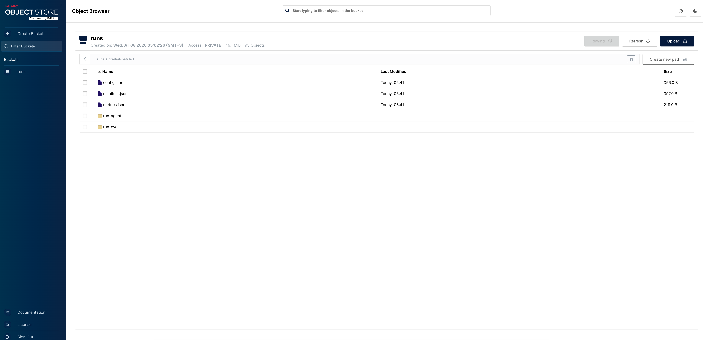

# REPORT — Coding-Agent Evaluation Pipeline

An end-to-end MLOps pipeline that evaluates coding agents: a parameterized Airflow DAG runs
[mini-swe-agent](https://github.com/SWE-agent/mini-swe-agent) over SWE-bench instances,
judges the patches with the SWE-bench harness, writes a reproducible `runs/<run-id>/`
artifact tree, uploads it to S3-compatible object storage (MinIO), and registers every run
in MLflow for side-by-side comparison.

Requirements: [SPEC.md](SPEC.md) · Architecture: [PLAN.md](PLAN.md)

---

## 1. Architecture

```
                        ┌────────────────────────────┐
   trigger w/ params    │        AIRFLOW             │
  ─────────────────────►│  UI ──► scheduler ──► DAG  │
                        │      evaluate_agent        │
                        └─────┬──────────────────────┘
                              │ python -m pipeline.cli <step>
                              │ (subprocess │ DockerOperator + task image)
                              ▼
   ┌──────────────────────────────────────────────────────────┐
   │              EXECUTION ENV (venv / container)            │
   │                                                          │
   │ prepare-run ─► run-agent ─► run-eval ─► summarize        │
   │      │             │            │           │            │
   │      ▼             ▼            ▼           ▼            │
   │ config.json   mini-swe-agent  SWE-bench   metrics.json   │
   │               (agent loop)    harness     manifest.json  │
   └───────┬───────────┬──────────────┬───────────┬───────┬───┘
           │           ▼              ▼           │       │
           │   ┌──────────────┐ ┌─────────────┐   │       │
           │   │ Nebius Token │ │Docker daemon│   │       │
           │   │ Factory (LLM)│ │(per-instance│   │       │
           │   └──────────────┘ │ eval ctrs)  │   │       │
           │                    └─────────────┘   ▼       ▼
           ▼                                 ┌────────┐ ┌────────┐
     runs/<run-id>/  ───────── upload ─────► │ MinIO  │ │ MLflow │
     (shared volume)                         │  (S3)  │ │ server │
                                             └────────┘ └────────┘
```

**The load-bearing decision:** orchestration and execution live in different Python
environments, connected only by a CLI contract (`python -m pipeline.cli <step>`). The DAG
file imports a single stdlib-only module (`pipeline/config.py`) and shells everything else
out. Consequences:

- Airflow's env needs zero project dependencies (no mlflow/boto3/swebench at parse time).
- The same DAG runs in two executor modes — `EXECUTION_MODE=subprocess` (dev) and
  `EXECUTION_MODE=docker` (DockerOperator + pinned image) — because only the *executor*
  changes, never the command.
- Per-instance SWE-bench evaluation containers are started through the mounted Docker
  socket, making them *siblings* of the task container (docker-out-of-docker).

The four tasks, with retry/timeout policy:

| task | does | retries | timeout |
|---|---|---|---|
| `prepare_run` | resolve params → `runs/<run-id>/config.json`, push `{run_id, run_dir}` to XCom | 0 | 5 m (covers cold `uv` bootstrap) |
| `run_agent` | mini-swe-agent batch → trajectories + `preds.json` | 1 | 120 m (env-tunable) |
| `run_eval` | SWE-bench harness → per-instance verdicts | 1 | 90 m (env-tunable) |
| `summarize_and_log` | metrics → manifest → S3 upload → MLflow (idempotent) | 2 | 5 m |

`summarize_and_log` is strictly ordered so the manifest *inside the uploaded copy* already
carries its own S3 URI (destination computed before upload), and retries are safe: S3
overwrites, MLflow finds-or-creates by `run_id` tag.

## 2. How to trigger a run

**UI:** open Airflow (8080) → `evaluate_agent` → Trigger → the form (generated from
`PARAM_DEFAULTS`) offers `split, subset, model, task_slice, workers, cost_limit, run_id`.
Every experiment value is a parameter — nothing is hard-coded in the DAG (SPEC C1).

Two UI quirks to know (both hit during the real deployment):
- Under compose, new DAGs start **paused** — flip the toggle before the first trigger.
- The Airflow 3.2 trigger form treats `run_id` as required even though the DAG's default
  is "auto-generate" — type any unused slug (e.g. `my-batch-1`); it becomes the run dir
  name, S3 prefix, and MLflow run name.

**CLI equivalent (same code path the DAG uses):**

```bash
uv run python -m pipeline.cli prepare-run --split test --subset verified --workers 4 --task-slice 0:3
uv run python -m pipeline.cli run-agent  --run-dir runs/<id>
uv run python -m pipeline.cli run-eval   --run-dir runs/<id>
uv run python -m pipeline.cli summarize  --run-dir runs/<id>
```

**Rerun by run id:** trigger the DAG with identical params plus a fresh id, e.g.
`run_id=<id>-rerun`. Reusing an existing id fails loudly at `prepare-run` (with guidance
to pick a fresh suffix) rather than overwrite a previous run's artifacts.

## 3. Artifact layout (the reproducibility contract)

```
runs/<run-id>/                       # <run-id> = <timestamp>__<subset>__<slice>
├── config.json                      # frozen RunConfig incl. package versions
├── run-agent/
│   ├── preds.json                   # instance_id → model_patch (the deliverable)
│   └── trajectories/<iid>/*.traj.json   # every agent step (the evidence)
├── run-eval/
│   ├── logs/<iid>/                  # patch.diff, eval.sh, test_output.txt, report.json
│   └── reports/                     # summary.json + per-instance verdicts
├── metrics.json                     # counters + resolve_rate
└── manifest.json                    # index of all of the above + S3 URI + MLflow pointers
```

Verified reconstruction test (SPEC 2.2/2.4): the folder was downloaded back from
`s3://runs/<run-id>/` into a clean location and answered, from files alone: which model
(`nebius/moonshotai/Kimi-K2.6`), which slice (`0:1` of verified/test), the resolve rate
(1.0), and where full artifacts live (the manifest's own S3 URI).

## 4. Completed evaluation (real VM run — the headline evidence)

Run **`graded-batch-1`**, triggered on a Nebius VM (8 vCPU / 32 GB, x86_64) under the full
docker-compose production stack (`EXECUTION_MODE=docker`, every step a `DockerOperator`
container): `split=test, subset=verified, task_slice=0:10, workers=4, model=nebius/moonshotai/Kimi-K2.6`.

- **Result:** `submitted 10 · completed 10 · resolved 6 · unresolved 4 · resolve_rate 0.6`
  — a real, non-trivial outcome (not a cherry-picked single instance).
- **Duration:** ~50 minutes end to end, `workers=4` confirmed genuinely parallel (multiple
  `minisweagent-*` containers with distinct instance images running concurrently via
  `docker ps`, not sequential).
- **Variance observed:** most instances resolved within minutes; one (`astropy-13977`)
  ground for 23+ minutes before finishing — the same long-tail behavior documented in
  BREAKDOWN.md's runtime analysis, here reproduced at real batch scale.
- The complete run — all 10 trajectories, eval logs, reports, `config.json`, `metrics.json`,
  `manifest.json` — is committed at [`runs/graded-batch-1/`](runs/graded-batch-1/) as evidence
  (SPEC 6.2), and was independently verified by uploading to MinIO and browsing the object
  store directly (see screenshot below).

An earlier smoke run (`20260707T214048__verified__0-1`, 1 instance, local) resolved
`astropy__astropy-12907` with `resolve_rate 1.0` — useful for exercising the pipeline
end-to-end quickly, but `graded-batch-1` is the run that demonstrates real variance and a
believable resolve rate.

## 5. MLflow evidence

Every pipeline run appears in experiment `swe-bench-evals`, tagged `run_id=<run-id>`,
with params (split/subset/model/slice/workers/cost_limit + package versions), metrics
(submitted/completed/resolved/unresolved/error counts + resolve_rate), and artifact
references (local path + S3 URI as tags). Runs are compared side by side in the UI via
checkbox → Compare — `screenshots/mlflow_runs.png` shows `graded-batch-1` (resolve_rate 0.6)
next to the earlier sanity check (resolve_rate 1.0) in the same comparison view.




## 6. Deployment modes

| | easy mode | production mode |
|---|---|---|
| bring-up | `bash run-airflow-standalone.sh` | `docker compose up -d` |
| Airflow | standalone, SQLite | apiserver/scheduler/dag-processor/triggerer + postgres (LocalExecutor) |
| execution | subprocess into project venv | `DockerOperator` on `coding-agent-eval-harness:latest` |
| MLflow / MinIO | run manually when needed | compose services (`http://mlflow:5000`, `http://minio:9000`) |
| env | `.env` + host paths | `.env` + compose overrides (in-network endpoints) |

Same DAG file, same CLI, same artifact tree in both. Production mode additionally needs
the task image built once on the host: `docker build -t coding-agent-eval-harness:latest .`

On a remote VM, keep all service ports closed to the internet (only SSH open) and reach
the UIs through a tunnel — note the local MLflow remap, since macOS AirPlay owns port 5000:

```bash
ssh -N -L 8080:localhost:8080 -L 5002:localhost:5000 -L 9001:localhost:9001 <vm-host>
```

## 7. Operational notes & gotchas (learned the hard way)

- **macOS AirPlay squats on port 5000**: use `http://127.0.0.1:5000` (or remap
  `MLFLOW_PORT`) — `localhost` resolves to `::1` where AirPlay answers 403.
- **MLflow 3.x rejects unknown Host headers** (DNS-rebinding protection, also a 403 —
  a *different* 403 on the same port). In-network clients arrive as `mlflow:5000`, so the
  compose service sets `MLFLOW_SERVER_ALLOWED_HOSTS=mlflow:5000,...`.
- **`run_id` is a reserved TaskFlow parameter name** — task functions avoid it; task
  data flows as a `{run_id, run_dir}` XCom dict.
- **mini-swe-agent writes `preds.json` inside its output dir** — `run_agent()` *copies*
  it to `run-agent/preds.json` for the SPEC 2.1 shape. It is a copy, not a move: the
  original is mini-extra's resume marker, so removing it would re-run the whole batch.
- **The harness writes relative to cwd** — `run_eval()` runs it with `cwd=run-eval/` and
  reshapes `logs/run_evaluation/<rid>/<model>/<iid>/` → `logs/<iid>/`.
- **`cost_limit=0` does NOT mean "unlimited"** — the packaged `swebench.yaml` sets its own
  `agent.cost_limit` (3.0), so the value is *always* passed explicitly (`agent.cost_limit=0`
  genuinely disables the ceiling, since the check is `0 < cost_limit <= cost`). Separately,
  cost tracking is a no-op for Kimi-via-Nebius (litellm has no pricing entry → tracked cost
  stays $0), so the step limit is the effective bound there regardless.
- **Retries must be idempotent, because they re-run over a populated run dir.** `run_eval`
  relocation overwrites (never `rename`s onto a non-empty dir → no `ENOTEMPTY`) and clears
  stale `sweb.eval.<iid>.<run_id>` containers first; `_cli` runs each step in its own
  process group and SIGKILLs the whole group on timeout so no orphan batch races the retry.
- **`run_id` reaches paths, globs, MLflow filters, and S3 keys** — `resolve_config`
  restricts explicit ids to a safe slug (`RUN_ID_PATTERN`), so no sink needs escaping.
- **Docker-mode env passthrough forwards only non-empty values** — an empty string would
  override the in-code defaults (`bucket_name()`, `experiment_name()`), so the DAG filters
  them out and the two executor modes stay equivalent.
- **`prepare-run` provenance** — under compose it runs on the bare Airflow image (no
  agent/harness installed), so `run_agent` re-records package versions from the execution
  env before `config.json` is consumed.
- **Fail fast on the VM** — compose `:?` guards make missing `HOST_PROJECT_DIR`/`DOCKER_GID`
  error at `compose up`, not deep inside a paid run (`DOCKER_GID=0` grants no socket access
  on a Linux host).
- **libraries print to stdout** (mlflow's "View run" banner) — the CLI redirects all
  in-process stdout to stderr and emits exactly one JSON line on the real stdout, because
  the DAG parses it.

## 8. Verification status

See the ticked checklist in [SPEC.md](SPEC.md) (Verification Checklist). Unit tests cover
the pure layers (`uv run pytest` — config, artifacts, command builders, metrics, manifest,
storage key layout, MLflow idempotency).
